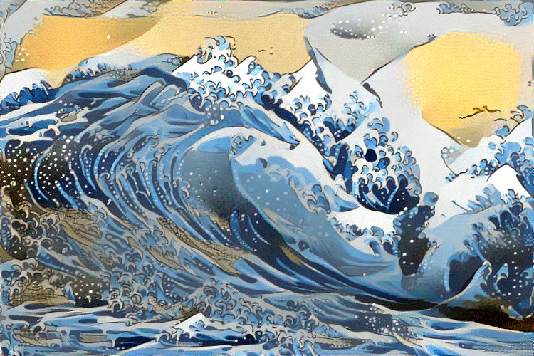

# Neural-Style-Transfer
# Usage: 
	nst = NeuralStyleTransfer(contentImagePath,styleImagePath,modelPath)
		-- contentImagePath: the path to the image you want to transfer
		-- styleImagePath: the path to the image you want to get the style from
		-- modelPath: imagenet vgg-19 model in this repository
	nst.run(num_iterations = 300)
You can download the vgg-19 model in this link:https://mega.nz/#!pIFimCCA!9nFD0KJ_ysx0NWfEs90bPkjvBMUn1Y82pYF-FrWLHw8

after the Neural Style Transfer finishes its task, you will find a folder named output in the same directory, and the result will be there.

 

